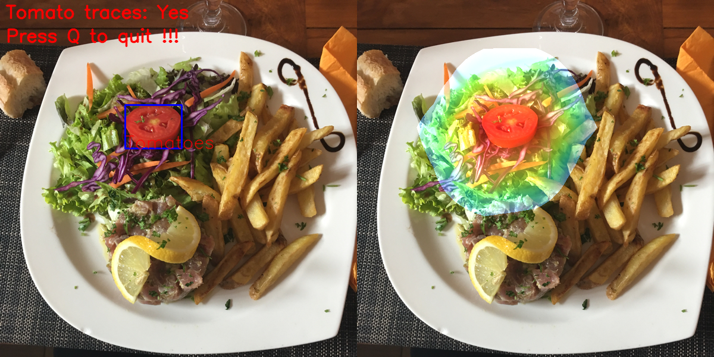
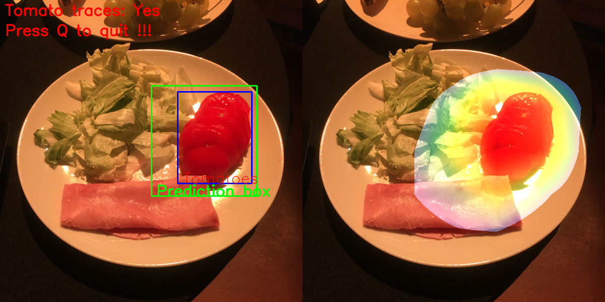

# Install requirements
To install all the necessary packages:
```
sudo apt install virtualenv
virtualenv -m python3 venv
source venv/bin/activate
pip3 install -r requirements.txt
```
# Training models
Firstly, you need to process images and annotations to generate tomato annotations.
```
python3 src/build_dataset.py \
    --image_dir path/to/image/folder \
    --label_mapping path/to/label_mapping.csv \
    --image_annotation_file path/to/img_annotations.json \
    --output_dir path/to/dataset
```

It will process and generate tomato dataset at `path/to/dataset` folder, which contains
a folder `0` for no tomato trace images, `1` for images containing tomatoes and a 
`tomato_annotations.json` file. Now model can be trained by 
```
python3 src/train.py --dataset_dir /path/to/dataset
```
This will train a model with default hyper parameters. These parameters
can be changed by inline arguments. Run `python3 src/train.py --help`
to see how to overwrite them.

At the end of training, by default the trained model and learning curves
will be exported to `resources` folder.

# Inference on a new image
```
python3 src/inference.py --model_dir path/to/saved/model --image_path path/to/test/image
```
It will save an `output_image.png` to the current directory. 


You can also
pass `label_mapping.csv` file and `annotations.json` of the test image
in order to have bounding boxes displayed on output image.
```
python3 src/inference.py \
    --model_dir path/to/saved/model \
    --image_path path/to/test/image \
    --label_mapping path/to/label_mapping.csv \
    --image_annotation_file path/to/tomato_annotations.json \
```


# Resources
[1] [https://www.tensorflow.org/](https://www.tensorflow.org/)

[2] [Learning Deep Features for Discriminative Localization](http://cnnlocalization.csail.mit.edu/Zhou_Learning_Deep_Features_CVPR_2016_paper.pdf)
